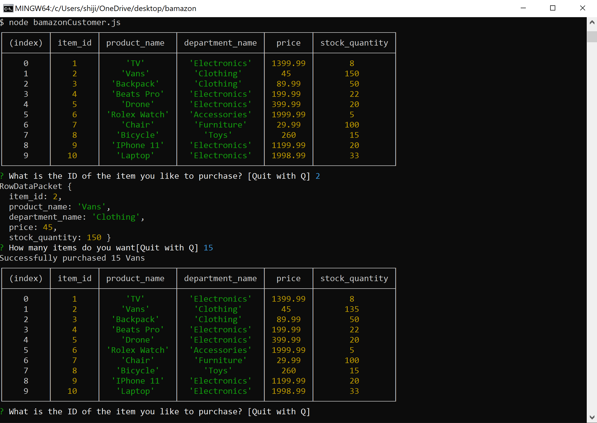
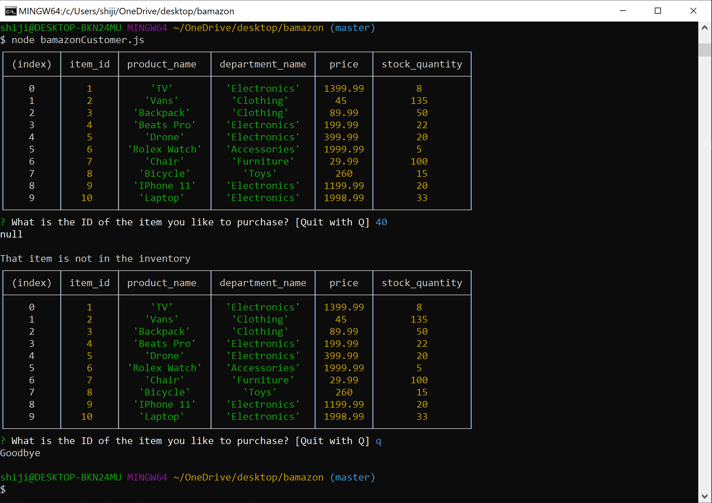
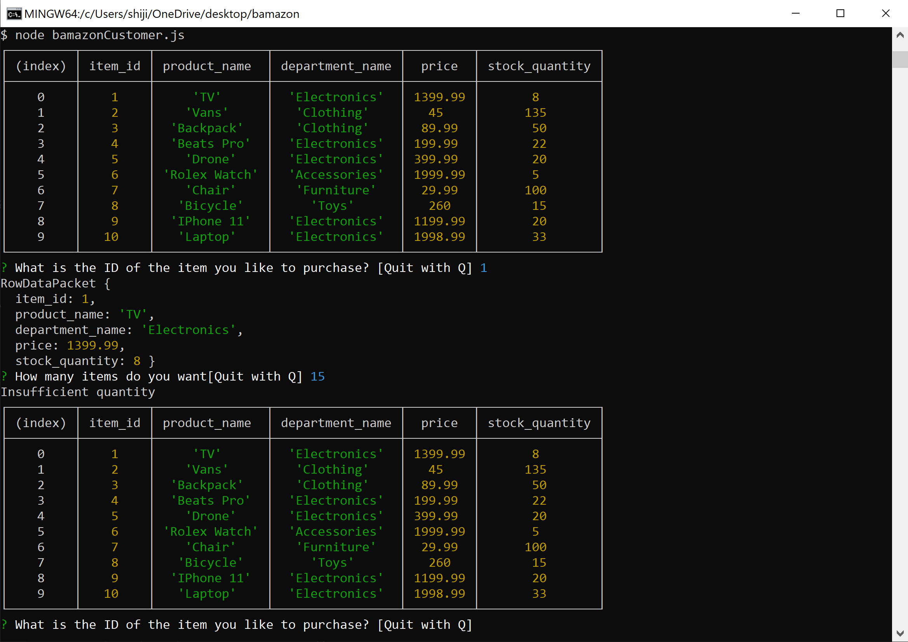

# bamazon

## What the project does?

Amazon like app using MySql, Javascript and Node.js. Running this application will first display all of the items available for sale.

The app then prompts the user with two messages:

* The first message asks the user the ID of the product they would like to buy.
* The second message asks how many units of the product they would like to buy.

Once the customer has placed the order, the application checks if store has enough of the product to meet the customer’s request.

* If not, the app logs a phrase like `Insufficient quantity!`, and then prevent the order from going through.

if the store does have enough of the product, it fulfills the customer’s order:

* This means updating the SQL database to reflect the remaining quantity.
* Once the update goes through, the app shows the customer the total cost of their purchase.

## Why the project is useful?

This project is useful because anyone who wants to implement a online store, it can be used as the skeleton.

## How to set up the app?

Step 1: Clone the repository to your desktop

Step 2: Open the gitbash/terminal window

Step 3: cd to desktop/bamazon

Now you can use the LIRI app.

`node bamazonCustomer.js`

PS: bamazonManager.js works but it's not fully functional.